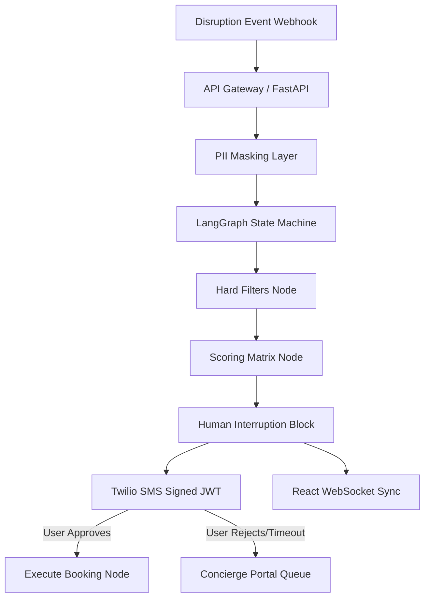

# Amex ConciergeAI

**Autonomous Travel-Disruption Resolution Engine**

Amex ConciergeAI transforms travel disruption handling from a high-friction, call-center-heavy process into an autonomous, sub-5-second, 1-click resolution pipeline for premium cardmembers. By utilizing LangGraph workflows, robust rule engines, and multi-channel synchronization, the engine ensures customers get rebooked instantly while maintaining strict enterprise compliance and security.

---

## Key Features

- **Real-Time Disruption Handling**: Automates rebooking from initial flight disruption detection through to booking confirmation.
- **Explainable AI (XAI) Audit Trail**: Logs structured JSON decision explanations (reasoning, filters passed, score breakdown) for every agent decision.
- **Dual Fallback Stack**: Automatically falls back to deterministic Python rule scripts (`filters.py` and `scoring.py`) in under `<50ms` if LLMs or external network APIs timeout (>3 seconds) or fail.
- **Multi-Factor Scoring Matrix**: Evaluates and ranks travel options on a rigorous weighted formula:
  - **Price Delta** (40%)
  - **Total Travel Time** (25%)
  - **Alliance / Cabin Match** (20%)
  - **Layover Count & Duration** (15%)
- **Omnichannel Sync**: Initiates WebSocket broadcasts to active React dashboards and dispatches a short-lived cryptographically signed JWT rebooking deep link via Twilio SMS.
- **Human-in-the-Loop (HITL) Handoff**: Escalates to a concierge agent portal with hydrated session history and a 15-second backup SLA fallback timer (auto-routes to VIP specialists).
- **PII Security & Compliance**: Strict tokenized card references and PII masking layers to protect sensitive user details.

---

## System Architecture



---

## Directory Structure

```
├── backend/
│   ├── app/
│   │   ├── agent/            # LangGraph workflow, checkpointer & orchestrator
│   │   │   ├── graph.py
│   │   │   ├── runner.py
│   │   │   └── state.py
│   │   ├── api/              # REST & WebSocket route gateways
│   │   │   ├── concierge.py
│   │   │   └── disruptions.py
│   │   ├── core/             # Application config and PII masking security
│   │   │   ├── config.py
│   │   │   └── security.py
│   │   ├── engine/           # Deterministic filtering and scoring
│   │   │   ├── fallback.py
│   │   │   ├── filters.py
│   │   │   └── scoring.py
│   │   ├── models/           # SQLAlchemy 2.0 and Pydantic v2 schemas
│   │   │   ├── schemas.py
│   │   │   └── sql_models.py
│   │   └── services/         # Redis connection, DB contexts, API clients
│   │       ├── amadeus_client.py
│   │       ├── database.py
│   │       ├── escalation.py
│   │       ├── redis_client.py
│   │       └── twilio_client.py
│   ├── Dockerfile
│   ├── main.py
│   └── requirements.txt
├── docker-compose.yml
└── README.md
```

---

## Local Setup & Installation

### Option 1: Docker Compose (Recommended)

1. Clone the repository.
2. Build and run the entire containerized stack (PostgreSQL, Redis, FastAPI Backend):
   ```bash
   docker-compose up --build
   ```
3. The API will spin up and be available at `http://localhost:8000`.

### Option 2: Local Python Execution

1. Create a Python 3.11 virtual environment and activate it:
   ```bash
   py -3.11 -m venv .venv
   .venv\Scripts\activate
   ```
2. Install standard dependencies:
   ```bash
   pip install -r backend/requirements.txt
   ```
3. Copy environment configuration file:
   ```bash
   cp backend/.env.example backend/.env
   ```
4. Start PostgreSQL and Redis instances locally.
5. Run the FastAPI development server:
   ```bash
   cd backend
   uvicorn main:app --reload --host 127.0.0.1 --port 8000
   ```

---

## Local API Verification & Testing Guide

Once the server is running, you can test the rebooking and escalation workflow:

### 1. Trigger a Disruption Event Simulation
Simulate a webhook ingestion trigger. Send a `POST` request to `http://localhost:8000/api/v1/disruptions/trigger`:
```json
{
  "user_id": 1,
  "flight_number": "AA123",
  "original_price": 800.0,
  "original_cabin": "BUSINESS",
  "original_alliance": "OneWorld",
  "user_phone": "+1234567890"
}
```
*Result*: The engine will start, pull alternative flight suggestions from the Amadeus service (using cached test scenarios locally), apply hard filters/scoring matrices, pause at the human approval node, and generate a signed JWT link in console/logs simulating Twilio delivery.

### 2. Live WebSocket Connection
Establish a WebSocket connection to `ws://localhost:8000/api/v1/disruptions/ws/1` using a tool (e.g. Postman WebSocket Client or browser script) to watch state updates stream dynamically in real-time.

### 3. JWT Rebooking Approvals
Retrieve the `/rebook/approve?token=...` link generated in the backend logs from step 1. Pasting it into a browser will decode the JWT signature, restore the LangGraph checkpointer session from Redis, complete the automated booking step, write booking logs into PostgreSQL, and broadcast a `RESOLVED` status event to the WebSocket channel.

### 4. SLA Handoff Handovers
If the rebooking proposal is rejected or remains unclaimed by an operator for more than 15 seconds, the SLA watchdog timer triggers, promoting the issue automatically to `VIP_AUTO_ROUTED` and archiving details inside Postgres logs.
- View escalated tickets in queue: `GET http://localhost:8000/api/v1/concierge/queue`
- Claim a ticket: `POST http://localhost:8000/api/v1/concierge/claim/{event_id}`
